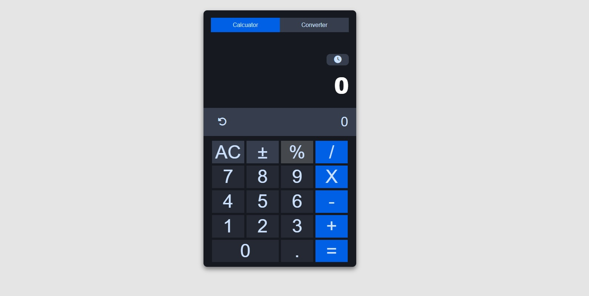
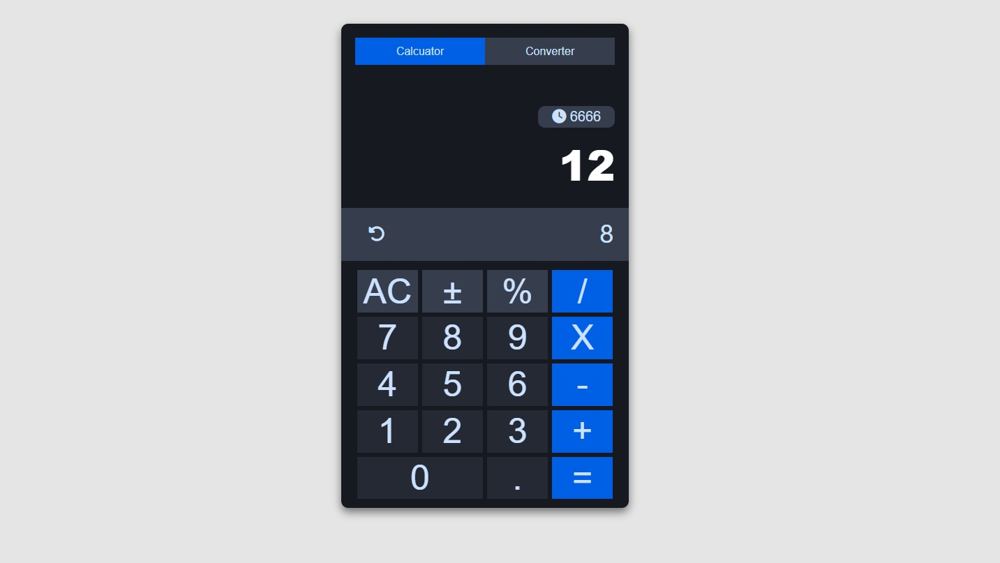

<h1 align="center"><i>Calculator</i></h1>

**_
Minimalistic Calculator, which can do all the basic math operations as well as save the field obtained result
_**

    

    
    

    
    

<h2>Setup:</h2>
- <i><b>Download or clone the repository</b></i>
- <i><b>To start: run npm start</b></i>

Used technologies:

- <i><b>JavaScript with React library</b></i>
- <i><b>HTML</b></i>
- <i><b>CSS</b></i>

